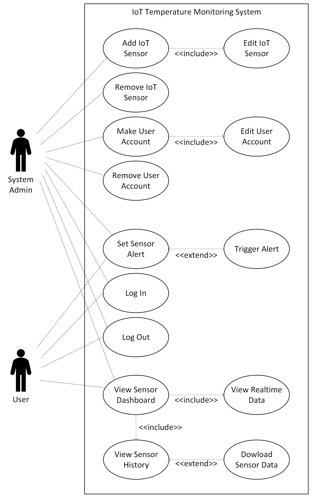

# The Project

The project provides you an opportunity to build upon the foundational knowledge acquired in this course. It is designed to help you develop an advanced understanding of software engineering principles, tools, and techniques using structured requirements gathering and analysis, software development process, design patterns, software architecture, and software testing.  You will also need to consider your development methodology (don’t use waterfall), software metrics, and software quality assurance.

As a team, you will select a project, develop a set of requirements, conduct a formal analysis of the project, develop an architecture, and then using TDD and an Agile workflow, iterate and develop your projects.  During your project, you MUST consider design patterns and anti-patterns, TDD, dockerization, and CI/CD.  The goal is not necessarily to build a complex system, but to practice and become comfortable with the techniques, be able to analyze and decompose a problem, and incrementally develop and deploy a solution using a branching workflow.

Internally, within your team, you are free to manage efforts and tasks with the understanding that everyone is expected to contribute equally in some fashion.  During the project, you will have the chance to confidentially conduct peer reviews using the credit-earned model (see document on Canvas regarding this) at a number of key points.   Your individual project grade will be impacted using the results of the peer evaluation.   The key point is that if you don’t contribute to the project, your mark will reflect this.  This will be discussed in class.

You must have:

* Unit tests and integration tests to ensure code quality and functionality
* A deployment pipeline using CI/CD to automatically test and deploy changes to the codebase
* Identified what design patterns you are using and describe why
* Dockerized deployment
* Continual and ongoing work using TDD 
*A team between 3-5 people (no more, no less) - target for 4

## Project Goals:

* To deepen the students' understanding of software engineering principles, tools, and techniques.
* To enable students to apply software engineering principles, tools, and techniques to the development of complex software systems.
* To introduce students to agile development methodologies, software metrics, and software quality assurance.
* To foster collaboration and teamwork among students in the development of software systems.

## Project Objectives:

By the end of this project, students will be able to:

* Apply the software development process model, to the development of a software system
* Design software systems using appropriate design patterns and principles
* Develop software architectures for complex software systems
* Use software testing techniques to ensure the quality of software systems
* Apply agile development methodologies to the development of software systems
* Apply software metrics to evaluate the quality of software systems
* Develop software quality assurance plans to ensure the quality of software systems
* Apply and develop a CI/CD pipeline for automated testing and deployment
* Utilize dockerization to containerize your application
* Work collaboratively in teams to develop software systems
* Peer Evaluation: see Peer Evaluation

## Evaluation:

**Milestone #1** – Team Formation and Planning Framework (March 7th) – Set up and join your team.   Let me know who is on your team (2%)

**Milestone #2** – Project Description and Requirements (March 13th).  A summary of “What” your project is, who the users are, and “What” your project will do (functional, non-functional requirements, etc) including use cases (properly dressed with the appropriate level of abstraction.   Consider the tools (proto-personal, journey lines)(13%)

**Milestone #3** – Formal Analysis and Architecture (March 19th).  
 * Use the appropriate models to present the details about what your system will look like, what it will do/be composed of and what your architecture is. (20%)
 * Test plan (5%)

**Milestone #4** – Testing/R&R Report/Release #1 (March 26th) (10%)

**Milestone #5** – Testing/R&R Report/Release #2 (April 2nd) (10%)

**Milestone #6** – Final Report/Demo video (April 9th) (20%)

**CI/CD (2 X 5%)**

**Process (2 x 5%)**

## The Projects:

**Discord Clone:** This project involves the development of a web-based platform for online communication and collaboration, similar to the popular chat app, Discord. The platform should incorporate the Observer design pattern to notify users of new messages, and the Mediator design pattern to manage communication between users and channels. The platform should also implement the Singleton design pattern to ensure that only one instance of the chat server is running at any given time, and the Command design pattern to enable users to execute commands (e.g. change username, join channel). Additionally, the platform should incorporate Continuous Integration and Deployment (CI/CD) and automated testing to ensure that updates are deployed quickly and without errors.

**iClicker Clone:** This project involves the development of a web-based platform for classroom polling and feedback. The platform should allow instructors to pose questions to students and receive instant feedback. The platform should incorporate the Observer design pattern to notify the instructor of student responses, and the Facade design pattern to simplify the interface between the user and the underlying system.  Additionally, the system should incorporate Continuous Integration and Deployment (CI/CD) and automated testing and deploy quickly and without errors. 

**Online Marketplace Application:** This project involves the development of a web-based application that facilitates online transactions between buyers and sellers. The application should incorporate the MVC (Model-View-Controller) design pattern to separate the concerns of the application into different components. The application should also implement the Observer design pattern to notify users of updates to their transactions.  Additionally, the system should incorporate Continuous Integration and Deployment (CI/CD) and automated testing.

**IoT Sensor Monitoring System:** This project involves the development of a system for monitoring and analyzing data from IoT sensors using MQTT. The system should incorporate the Publish-Subscribe design pattern to enable sensors to publish data and clients to subscribe to relevant data streams. The system should also implement the Chain of Responsibility design pattern to manage and filter data streams, and the Adapter design pattern to enable different types of sensors to communicate with the system. Additionally, the system should incorporate Continuous Integration and Deployment (CI/CD) and automated testing to ensure that data is collected accurately and without errors. The system should provide real-time visualizations of sensor data and alert users when thresholds are exceeded.

___

## Group Name: Pirates of the C

Group Members: 
- Kyle Keim (46335485)	
- Einar Schiele (64296734)
- Mehul Raisingh (46168746)	
- Ryan Tschritter (47341862)

## Project Description:

### What is the project:

For this project we will be developing an internet of things (IoT) sensor monitoring system for a large-scale commercial building; in this case a hospital. This system will be designed to sense and monitor the changes in temperature of the environment over a period of time. Based on certain parameters entered by the user, the system will respond differently at different temperature levels and different levels of temperature fluctuation.

### Who are the users:

Primary users of the system include anyone who is directly dealing or monitoring the system. These users include:

- Technicians entering the system’s detection parameters
- Employees that are continuously monitoring the system
- Emergency service professionals that may need to monitor or interact with the system

Secondary users are users who would indirectly use the system. These users include:

- Emergency personal
- Maintenance staff
- Individuals in an area which is monitored by the sensor

## Project requirements:

### Functional requirements:

- Users will be able to monitor temperature sensors in real time through a web browser client
- System will alert the users when the temperature exceeds the threshold
- System will automatically reconnect to sensors if connection is lost
- System will store past temperature data
- Users will be able to add or remove sensors

### Domain requirements:

- The system should read and return values in degrees celsius.

### Non-functional requirements:

- N/A

### Product requirements:

- System will be developed using python
- The readout of the sensors should be minimalistic, understandable and easy to read. (ex: Not returning machine code.)
- The sensors should publish their readings at a set interval and not lag or lead this timed interval. In this case, every 500ms should suffice. 
- The system should restart automatically if it goes down for any reason (ex: power outage)

### Organizational requirements:

- System will implement automated testing
- System will implement the publish-subscribe design pattern
- System will incorporate continuous integration and deployment
- System will implement the chain of responsibility design pattern
- System will implement the adapter design pattern
- System will use MQTT
- The system should be able to easily integrate a new sensor if required.

### External Requirements:

- The system must be secure, therefore a password will be required to access the data and administrative commands.

## Use Cases

    Use Case 1: <Add IoT Sensor>
        Primary actor: System Admin
        Description: Adding a IoT sensor to the monitoring system
        Pre-condition: Admin must be logged in, identical sensor must not already exist
        Post-condition: Given options to edit the new sensor

        Main scenario:
            1. Admin types name of new sensor
            2. Admin types information about new sensor
            3. Admin creates new sensor

        Extensions:
            - If incorrect information is entered admin is prompted to fix information
            - After adding sensor admin edits display configuration in monitoring system

    Use Case 2: <Edit IoT Sensor>
        Primary actor: System Admin
        Description: Edit IoT sensor information and display configuration
        Pre-condition: Admin must be logged in, Sensor has been created successfully
        Post-condition: Changes have been applied to sensor configuration

        Main scenario:
            1. Admin select to edit an individual sensor
            2. Admin changes values
            3. Admin applies configuration changes

        Extensions:
            - If incorrect information is entered admin is prompted to fix information before exiting

    Use Case 3: <Remove IoT Sensor>
        Primary actor: System Admin
        Description: Removes a sensor from the monitoring system
        Pre-condition: Admin must be logged in, The system contains a valid sensor
        Post-condition: The sensor is removed from the monitoring system

        Main scenario:
            1. The admin selects to remove a sensor
            2. The admin selects what sensor to remove
            3. The admin verifies that they want to remove the sensor
            4. The sensor is remove from the monitoring system

        Extensions:
            - Verification prompt is presented to prevent accidental removal

    Use Case 4: <Make User Account>
        Primary actor: System Admin
        Description: The system admin will add a new account to the database.
        Pre-condition: Admin must be logged into the system
        Post-condition: A new user account will be added to the system.

        Main scenario:
            1. The admin navigates to the correct webpage to add a user account.
            2. The admin uses the ‘add new user’ button.
            3. The admin enters the new user’s information into the correct fields.
            4. The admin hits the ‘finalize new user button’ when done.
            5. The admin will log out when finished.

        Extensions:
            3.1. The admin tries to edit a field with an incorrect domain value
                3.1.1. Display an “incorrect domain” error message.
            4.1 The admin tries to finalize the user information without filling out all the fields.
                4.1.1 Display “All fields are not completed” error message and prevent submission.

    Use Case 5: <Edit User Account>
        Primary actor: System Admin
        Description:The system admin will edit an account that has already been created from the database.
        Pre-condition:Admin must be logged into the system, user account database must not be empty.
        Post-condition: An account already in the system will be edited.

        Main scenario:
            1. The admin navigates to the correct webpage to remove a user account.
            2. The admin finds the correct user account and hits the edit user’ button.
            3. The admin edits the user’s account information.
            4. The admin will log out when finished.

        Extensions:
            2.1. The admin tries to edit a field with an incorrect domain value
                2.1.1. Display an “incorrect domain” error message.

    Use Case 6: <Remove User Account>
        Primary actor: System Admin
        Description: The system admin will remove an account that has already been created from the database.
        Pre-condition: Admin must be logged into the system, user account database must not be empty.
        Post-condition: An account already existing in the system will be deleted.

        Main scenario:
            1. The admin navigates to the correct webpage to remove a user account.
            2. The admin finds the correct user account and hits the ‘remove user’ button.
            3. The admin will log out when finished.

        Extensions:
            2.1. Admin tries to remove an account that no longer exists.
                2.1.1 Display an “User no longer exists” error.

    Use Case 7: <Set Sensor Alert>
        Primary actor: System Admin
        Description: The system admin will set the sensor alert temperature to a given temperature or change the value already in the system.
        Pre-condition: Admin must be logged into the system.
        Post-condition: A new global sensor alert temperature has been set for the sensor monitoring system.

        Main scenario:
            1. The admin navigates to the correct webpage to set the sensor alert.
            2. The admin will click the ‘set sensor alert temp.’ button.
            3. The admin will input a new sensor alert temperature.
            4. The admin will log out when finished.

        Extensions:
            2.1 An out of bounds ‘sensor alert temp.’ value is input.
                2.1.1 Display an “incorrect temp value” error message  

    Use Case 8: <Viewing Sensor Readouts>
        Primary actor: System User
        Description: The user will go onto the website and be able to see the temperature readouts of every sensor in the hospital. They can also view real-time data, sensor history, and even download sensor data.
        Pre-condition: user must be logged into the system
        Post-condition: The user will have advanced knowledge of the temperature readouts of all the hospital rooms.

        Main scenario:
            1. The user finds the IoT sensor website.
            2. The user finds what sensors they are looking for.
            3. The user accesses data of the specified temperature sensors and can view real-time data, sensor history, or download sensor data.
            4. The user logs out of the system when finished.

        Extensions:
            3.1 The data is corrupted or not recorded.
                 3.1.1 Display an “Information incorrect” error message.
    
    Use case for loging in and out of system was not included as it is self explanatory to a professional reading this diagram.

## Assumption/constraints:

- There is a secure network for communication between devices.
- We will assume that during the system’s operation, there are no significant interruptions in power.
- Assume there are no faulty sensors, and their returned temperature values are correct.
- Assume that we have infinite memory storage and wont run out.
- Assume all heating/cooling devices are operating normally and at a consistent rate.
- Assume the user is on the hospital grounds when accessing the website.